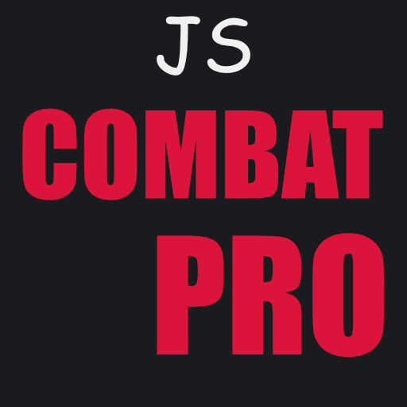

# JS Combat Pro <a href="/gaming/#/not-aproved" class="hero-info-btn small">Info</a>

---

This modpack is engineered to give you the competitive edge in Minecraft PvP through maximum performance, reduced latency, and enhanced battlefield awareness.

The pack is designed to comply with the regulations of most major PvP networks. However, it remains your responsibility to verify the permitted mods for each specific server.

---

## Features

* **Peak Performance:** Built on the latest Fabric loader and optimized with **Sodium, Lithium, and more** to ensure ultra-high FPS and minimal input lag—essential for landing every hit.
* **Competitive HUD:** Includes vital on-screen info like **Armor Status, Potion Effects, and Totems**, allowing you to track your resources without losing focus on the fight.
* **Enhanced Visibility:** Featuring mods like **No Fog** and **Fullbright** to ensure you spot opponents instantly, regardless of lighting or weather conditions.
* **Combat Fluidity:** Small tweaks like **Better Shields** and **Reduced fire overlays** keep your view clear during intense, high-action encounters.
* **Fair Play:** No gameplay-altering cheats. This pack focuses on optimizing your client’s efficiency and your own skill potential while staying within the vanilla mechanics.

---

## Gallery

  
  
  
  
  

---

## Connect

Feel free to join my [Discord](https://discord.gg/VzVJ3zCaJY) if you need help or just want to hang out with the community.