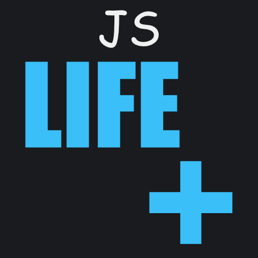

# JS Life+ <a href="/gaming/#/not-aproved" class="hero-info-btn small">Info</a>

---

This modpack aims to make Survival Let's Plays and SMP server experiences more enjoyable. It offers significantly more improvements and features than the [JS Basic Play](https://modrinth.com/modpack/js-basic-play) modpack.

This modpack may be restricted on some public servers due to mods like MouseTweaks or ClientSort. Use it at your own risk and stay informed about server rules.

---

## Features

* **Small performance Optimizations:** Built on the latest Fabric loader with essential mods like Sodium, Lithium, and FerriteCore for a smooth experience.
* **Quality of Life:** Enhancements like dynamic crosshairs, better UI handling, Freecam, and more.
* **Visual Improvements:** Includes Iris Shaders, EuphoriaPatches, and 3D Skin Layers for a modern and polished look.
* **Vanilla-Friendly:** Subtle gameplay changes that preserve the classic Minecraft feeling you know and love.

---

## Gallery

  
  
  
  
  

---

## Connect

Feel free to join my [Discord](https://discord.gg/VzVJ3zCaJY) if you need help or just want to hang out with the community.